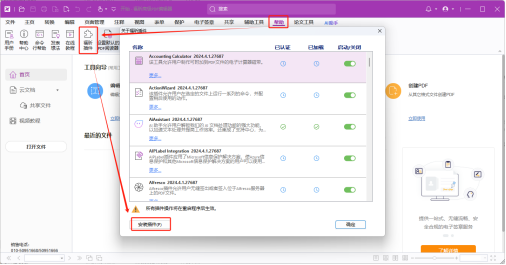

#  Javascript Plug-in Samples

JavaScript Plug-in Samples 是 JavaScript Plug-in SDK 的配套示例集，直观地展示在不同场景下如何运用该SDK，包含 Html 和 Vue 这两种典型示例，具体内容如下：

| 示例     | 说明                                                         |
| ---------- | ------------------------------------------------------------ |
| Annotation | 演示对PDF文件中注释进行添加、编辑和删除操作的示例。          |
| InsertText | 演示如何在PDF页面中插入文本对象，包括文本定位和格式设置。    |
| RibbonBar  | 演示如何在编辑器界面上使用Ribbon按钮进行各种操作的示例。     |
| SearchText | 演示在PDF文件中搜索特定文本并高亮显示结果的操作示例。        |
| Document   | 演示对文档的相关操作，翻页，获取文档权限，关闭保存文档等。 |

在每个示例中，均提供了相应的安装与运行指南。不过，在使用这些示例之前，务必提前完成福昕高级 PDF 编辑器以及 JavaScript 插件管理器插件的安装。

### 安装福昕高级PDF编辑器

从福昕软件官方网站下载福昕高级PDF编辑器安装包并安装。
推荐下载地址：https://www.foxitsoftware.cn/pdf-editor/

### 安装JavaScript插件管理器插件

JavaScript插件管理器（JavaScript Plug-in Manager）插件负责管理JavaScript插件插件的整个生命周期。福昕高级PDF编辑器必须安装该插件，才能实现对JavaScript插件插件的加载与运行操作。你可以从[福昕插件商店](https://developers.foxitsoftware.cn/store/)下载到该插件，之后依据下面步骤安装。

1. 点击 “帮助” 工具栏，然后点击工具栏上的 “福昕插件” 按钮，在弹出的对话框左下角点击 “安装插件”（如图 1 所示）。

2. 在弹出的 “打开对话框” 中，找到从福昕插件商店下载的 JavaScript插件管理器 插件，一般是一个 fzip 后缀的文件，选择该文件后点击 “打开”。

3. 等待插件安装完成，当弹出成功提示后，点击 “确定” 然后重新启动福昕高级PDF编辑器以完成插件安装。

4. 重启福昕高级PDF编辑器后打开 “福昕插件”，就会看到 JavaScript插件管理器 插件已经成功安装，点击 “安装JS插件” 按钮即可。

