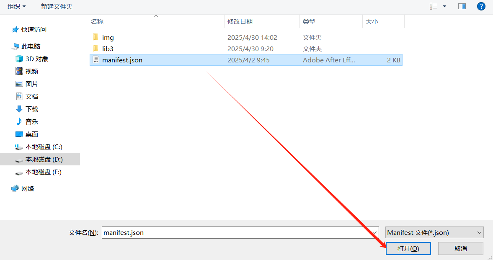

# Annotation Sample

### Annotation Sample 的作用
`Annotation Sample` 演示对PDF文件中注释进行添加、编辑和删除操作的示例。

#### 安装插件
> 注意不同语言下的按钮名称可能会有所不同
1. 打开 Foxit PDF Editor
2. 点击工具栏的“帮助”按钮
3. 再次点击“帮助”按钮下的二级按钮 “福昕插件”
4. 在弹出的窗口中，点击“安装JS插件”
5. 点击 “安装JS插件”后会弹出系统选择框，请自行找到当前sample插件的`manifest.json` 文件，选择后点击“打开”即可完成安装。
6. 安装完成后，会弹窗提示，在 Foxit PDF Editor 的工具栏中会出现一个名为“Annotation”的按钮，点击即可使用这个插件。

#### 卸载插件
> 注意不同语言下的按钮名称可能会有所不同
1. 点击工具栏的“Help”按钮（中文可能是“帮助”按钮）
2. 再次点击“Help”按钮下的二级按钮 “福昕插件”
3. 找到对应插件，选择后右侧会出现 删除按钮，点击删除按钮即可
4. 点击删除后，关闭 Foxit PDF Editor 后，插件会自动卸载。

