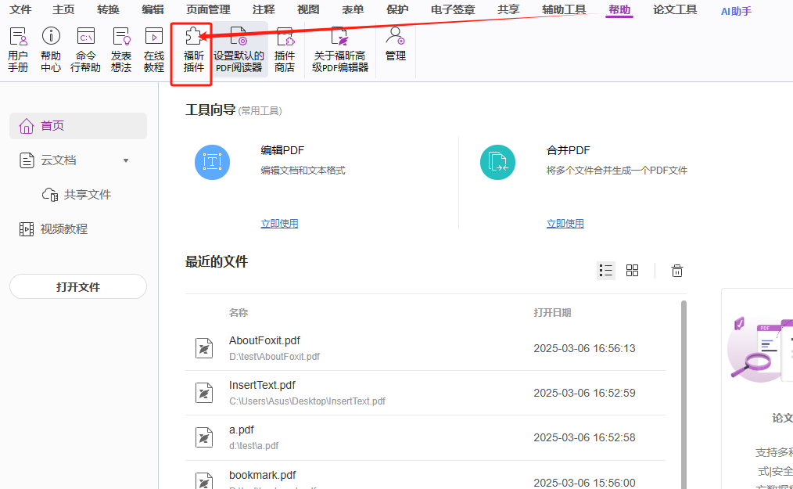
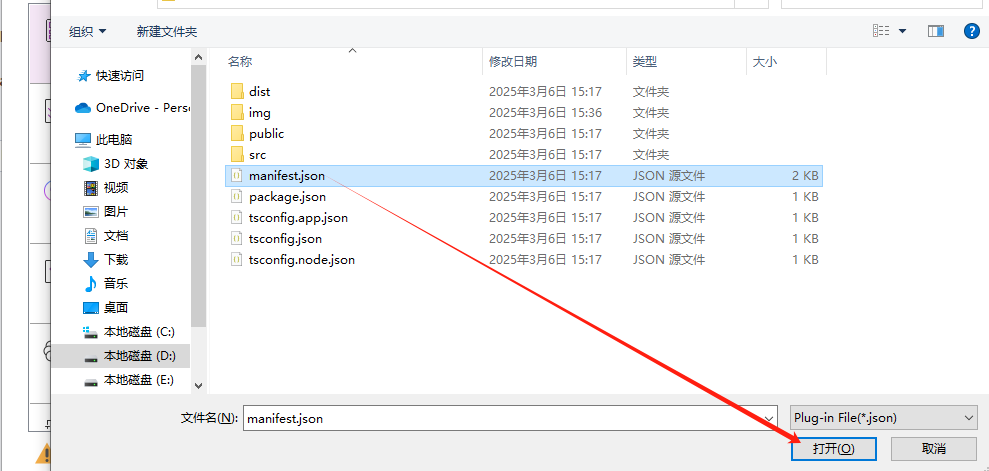
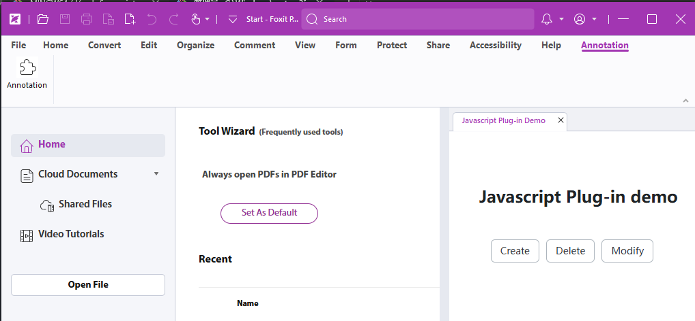
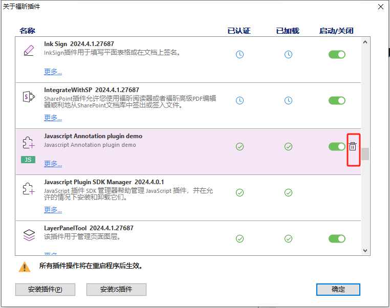

# Annotation Sample

### Annotation Sample 的作用
`Annotation Sample` 主要用于在 PDF 文件中添加、编辑和删除注释。注释可以是文本注释、高亮、下划线、删除线等多种形式。这些功能通常用于文档审查、批注或标记重要的信息。通过 `Annotation Sample`，用户可以方便地与 PDF 文档进行交互，提高文档处理的效率和准确性。

#### 1. 安装依赖
首先，安装所需的依赖库：
```bash
npm install
# or
npm i
```

#### 2. 启动 Annotation 这个插件
运行以下命令启动 Annotation 插件：
```bash
npm run dev
```
#### 安装插件
> 注意不同语言下的按钮名称可能会有所不同
1. 打开 Foxit PDF Editor
2. 点击工具栏的“Help”按钮（中文可能是“帮助”按钮）
3. 再次点击“Help”按钮下的二级按钮 foxit Plug-ins
4. 在弹出的窗口中，点击“Install Plugin”
5. 点击 “Install Plugin”后会弹出系统选择框，请自行找到当前sample插件的`manifest.json` 文件，选择后点击“Open”即可完成安装。
6. 安装完成后，会弹窗提示，在 Foxit PDF Editor 的工具栏中会出现一个名为“Annotation”的按钮，点击即可使用这个插件。






#### 卸载插件
> 注意不同语言下的按钮名称可能会有所不同
1. 点击工具栏的“Help”按钮（中文可能是“帮助”按钮）
2. 再次点击“Help”按钮下的二级按钮 foxit Plug-ins
3. 找到对应插件，选择后右侧会出现 删除按钮，点击删除按钮即可
4. 点击删除后，关闭 Foxit PDF Editor 后，插件会自动卸载。

