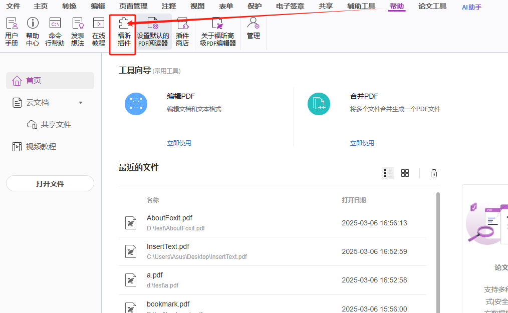
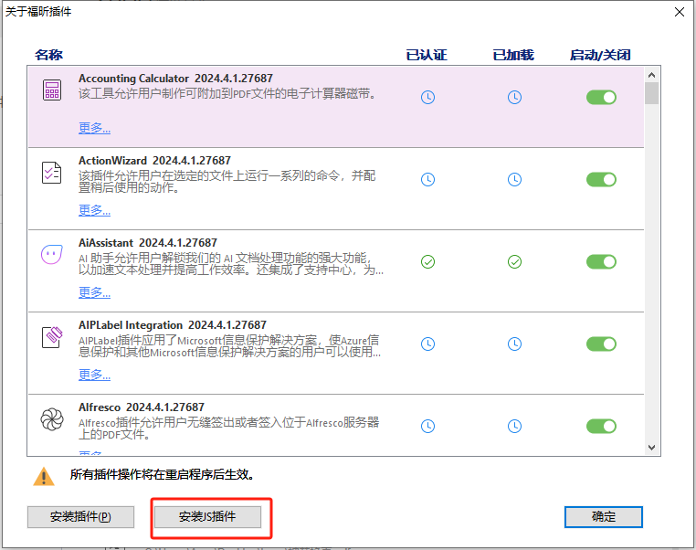
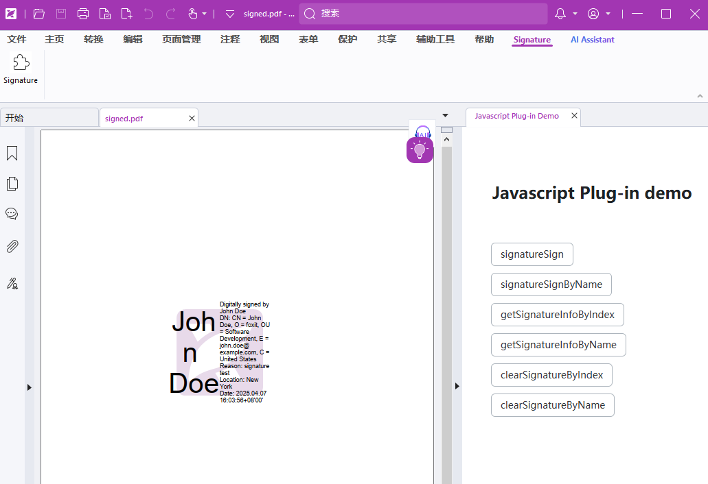

# Signature Sample

### Signature Sample 的作用
`Signature Sample` 演示在PDF文件中搜索特定文本并高亮显示结果的操作示例。

#### 1. 安装依赖
首先，安装所需的依赖库：
```bash
npm install
# or
npm i
```

#### 2. 启动 Signature 这个插件
运行以下命令启动 Signature 插件：
```bash
npm run dev
```
#### 安装插件
> 注意不同语言下的按钮名称可能会有所不同
1. 打开 Foxit PDF Editor
2. 点击工具栏的“帮助”按钮
3. 再次点击“帮助”按钮下的二级按钮 “插件管理” (其他版本可能是：“福昕插件”)
4. 在弹出的窗口中，点击“安装插件(P)”
5. 点击 “安装插件(P)”后会弹出系统选择框，请自行找到当前sample插件的`manifest.json` 文件，选择后点击“打开”即可完成安装。
6. 安装完成后，会弹窗提示，在 Foxit PDF Editor 的工具栏中会出现一个名为“Signature”的按钮，点击即可使用这个插件。





#### 卸载插件
> 注意不同语言下的按钮名称可能会有所不同
1. 点击工具栏的“帮助”按钮
2. 再次点击“帮助”按钮下的二级按钮 “插件管理” (其他版本可能是：“福昕插件”)
3. 找到对应插件，选择后右侧会出现 删除按钮，点击删除按钮即可
4. 点击删除后，关闭 Foxit PDF Editor 后，插件会自动卸载。

